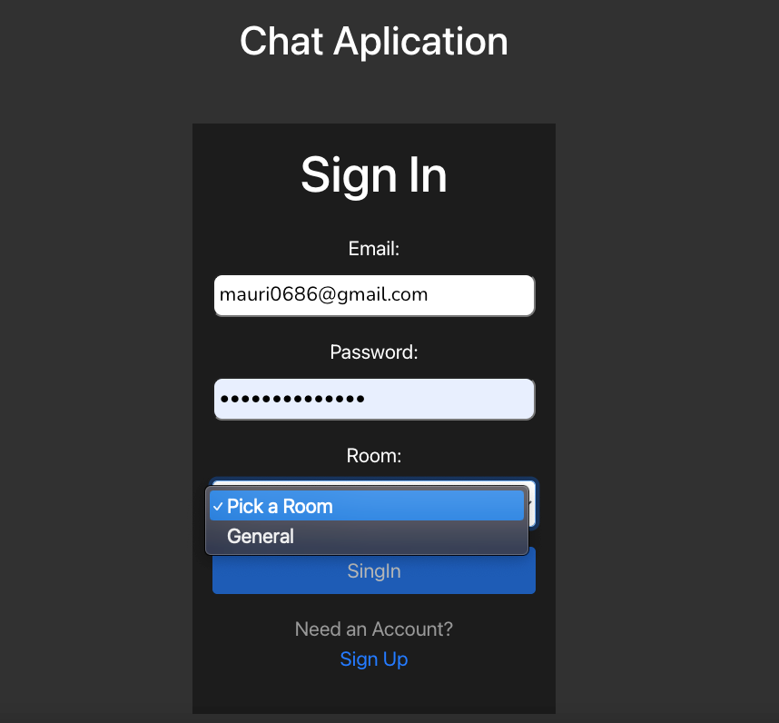
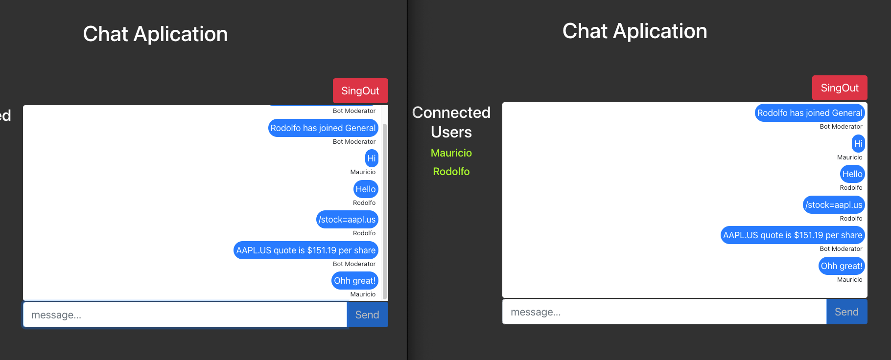
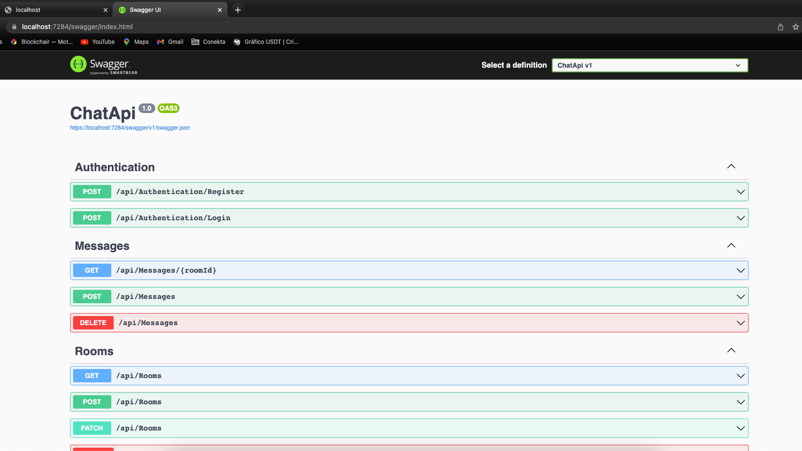
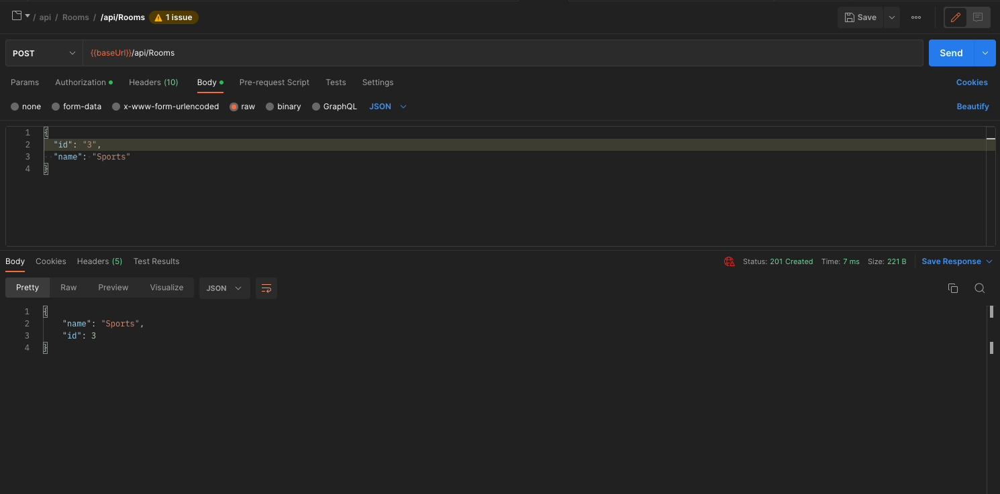
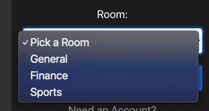

# Chat Aplication

## Technology

 
### Login

## Chat Lobby

## API REST .net 6

## Installation
#### *** The ChatApp.db is included in the repository but it could be created from the code if necessary:
cd /ChatAplication/ChatInfrastructure
dotnet ef --startup-project ../ChatApi migrations add inicial
dotnet ef --startup-project ../ChatApi database update
*********************************************************

#### Running the ChatApi
cd /ChatAplication/ChatApi/ dotnet run

#### Running the React Front
Configure Chat URL "ChatReactSite/ClientApp/.env"
REACT_APP_CHAT_URL=https://localhost:{YOUR-PORT}/chat

cd /ChatAplication/ChatReactSite/ClientApp npm start
or
cd /ChatAplication/ChatReactSite dotnet run

## SingUp is need

#### Interacting with Api

#### Add as many rooms as you need

